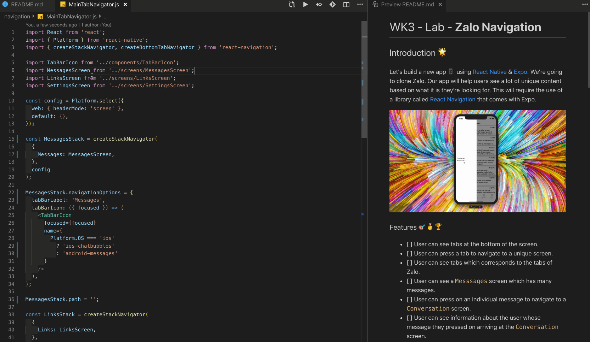
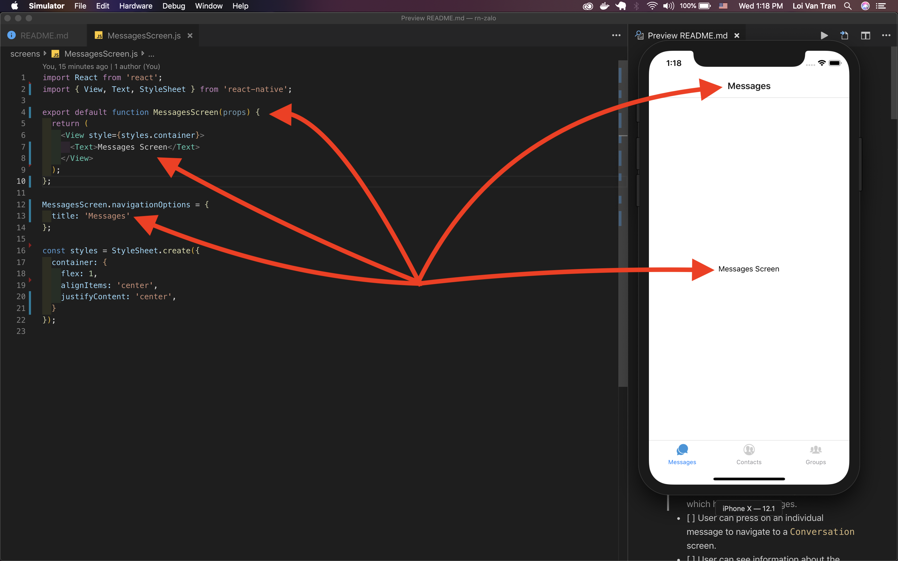
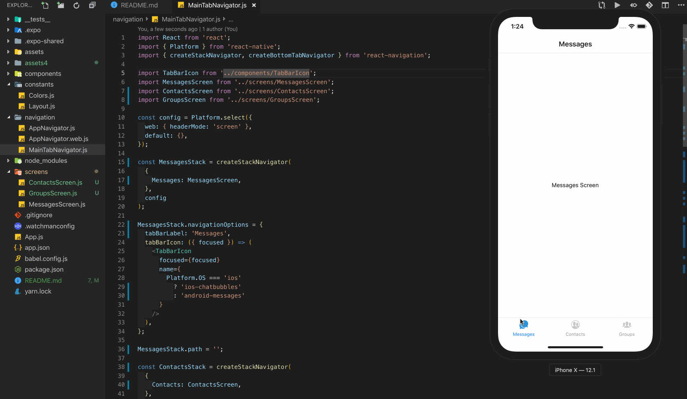

# WK3 - Lab - **Zalo Navigation**

## Introduction 🌟

Let's build a new app 📱 using [React Native](https://facebook.github.io/react-native/) & [Expo](https://expo.io/). We're going to clone Zalo. Our app will help users see a lot of unique content based on what it is they're looking for. This will require the use of a library called [React Navigation](https://reactnavigation.org/) that comes with Expo.


### Features 🎯🥇🏆

- [ ] User can see tabs at the bottom of the screen.
- [ ] User can press a tab to navigate to a unique screen.
- [ ] User can see tabs which corresponds to the tabs of Zalo.
- [ ] User can see a `Messsages` screen which has many messages.
- [ ] User can press on an individual message to navigate to a `Conversation` screen.
- [ ] User can see information about the user whose message they pressed on arriving at the `Conversation` screen.
- [ ] User can see an icon on the `Messages` screen which when pressed, opens a `Drawer`.
- [ ] User can see additional navigation items when they **open** the `Drawer`.

### Learning Objectives ✍️📚📝

1. Learn more about passing props.
    - Recognize we can pass many different props to components. These props can be of many different datatypes 🍚🥦🍗🌶. Types include `String`, `Boolean`, `Object`, and, `Function`.

> **Tip** 💡: 

### **Milestone 1 🛣🏃 Setup initial screens**

**A)** Use `expo init` to generate a new project. I'm calling mine `rn-zalo`. This time however, choose the **tabs** option when prompted.


#### We should now see a new boiler plate app when we open our simulator that has 3 default tabs at the bottom, `Home`, `Links`, & `Settings`


> **Tip** 💡: This project has a lot of stuff setup for you. Poke around the inital code for a minute or two to see how the team at Facebook likes structuring their projects. You'll learn a lot!

**B)** Refactor first tab.

We're going to need 5 screens `Messsages`, `Contacts`, `Groups`, `Timeline`, & `More` eventually. Let's start with `Messages`.

Open up the `./navigation/MainTabNavigator.js` file and look for the following line.

```jsx
import HomeScreen from '../screens/HomeScreen';
```

Then change it to

```jsx
import MessagesScreen from '../screens/MessagesScreen';
```

We're changing the component we're importing and where we're importing from in order to be more explicit to our future teammates.

**C)** Change the places where `HomeScreen` was previously used and change it to correspond to the new value(`Messages`). There are other keys/variables we should change as well in order to be consistent

```jsx
const MessagesStack = createStackNavigator(
  {
    Messages: MessagesScreen,
  },
  config
);
```

This is a [Stack Navigator](https://reactnavigation.org/docs/en/stack-navigator.html).

```jsx
MessagesStack.navigationOptions = {
  tabBarLabel: 'Messages',
  tabBarIcon: ({ focused }) => (
    <TabBarIcon
      focused={focused}
      name={
        Platform.OS === 'ios'
          ? 'ios-chatbubbles'
          : 'android-messages'
      }
    />
  ),
};
```

Here were defining out [Navigation Options](https://reactnavigation.org/docs/en/navigation-options-resolution.html#docsNav). Specifically, what the tab says and what icon is displayed.

```jsx
MessagesStack.path = '';
```

**D)** Update the name of the file from `./screens/HomeScreen.js` to `./screens/MessagesScreen.js`

Everything should continue working, however our `Home` tab should be replaced with `Messsages` and should display a different icon.



**E)** Delete everything in `MessagesScreen.js` and refactor to get a blank screen with a minimal amount of text, `Messages Screen`

<details>

<summary>New Messages Screen</summary>

```jsx
import React from 'react';
import { View, Text, StyleSheet } from 'react-native';

export default function MessagesScreen(props) {
  return (
    <View style={styles.container}>
      <Text>Messages Screen</Text>
    </View>
  );
};

MessagesScreen.navigationOptions = {
  title: 'Messages'
};

const styles = StyleSheet.create({
  container: {
    flex: 1,
    alignItems: 'center',
    justifyContent: 'center',
  }
});
```

</details>


There's nothing fancy going on here. Just a few required imports, a functional component defined, styles, and some additional [Navigation Options](https://reactnavigation.org/docs/en/redux-integration.html#what-about-navigationoptions).

Take note of the following lines.

```jsx
MessagesScreen.navigationOptions = {
  title: 'Messages'
};
```

The `title` key of the object in this code corresponds to the header we see at the top of the screen. There are other options as well which we'll soon work with..

**F)** Repeat for `Contacts` & `Groups`.

For these two, we'll rename the files, import, definitions, and appropriate variables to correspond to this content it will hold like we did with `Messages`.

<details>

<summary>LinksScreen => ContactsScreen</summary>

```jsx
// ./navigation/MainTabNavigator.js
import ContactsScreen from '../screens/ContactsScreen';
```

```jsx
// ./navigation/MainTabNavigator.js
const ContactsStack = createStackNavigator(
  {
    Contacts: ContactsScreen,
  },
  config
);

ContactsStack.navigationOptions = {
  tabBarLabel: 'Contacts',
  tabBarIcon: ({ focused }) => (
    <TabBarIcon
      focused={focused}
      name={
        Platform.OS === 'ios'
          ? 'ios-contacts'
          : 'md-link'
      }
    />
  ),
};

ContactsStack.path = '';
```

```jsx
// ./screens/ContactsScreen.js
import React from 'react';
import { View, Text, StyleSheet } from 'react-native';

export default function ContactsScreen(props) {
  return (
    <View style={styles.container}>
      <Text>Contacts Screen</Text>
    </View>
  );
};

ContactsScreen.navigationOptions = {
  title: 'Contacts'
};

const styles = StyleSheet.create({
  container: {
    flex: 1,
    alignItems: 'center',
    justifyContent: 'center',
  }
});
```

</details>

<details>

<summary>SettingsScreen => GroupsScreen</summary>

```jsx
// ./navigation/MainTabNavigator.js
import GroupsScreen from '../screens/GroupsScreen';
```

```jsx
// ./navigation/MainTabNavigator.js
const GroupsStack = createStackNavigator(
  {
    Groups: GroupsScreen,
  },
  config
);

GroupsStack.navigationOptions = {
  tabBarLabel: 'Groups',
  tabBarIcon: ({ focused }) => (
    <TabBarIcon
      focused={focused}
      name={
        Platform.OS === 'ios'
          ? 'ios-people'
          : 'md-options'
      }
    />
  ),
};

GroupsStack.path = '';
```

```jsx
// ./screens/GroupsScreen.js
import React from 'react';
import { View, Text, StyleSheet } from 'react-native';

export default function GroupsScreen(props) {
  return (
    <View style={styles.container}>
      <Text>Groups Screen</Text>
    </View>
  );
};

GroupsScreen.navigationOptions = {
  title: 'Groups'
};

const styles = StyleSheet.create({
  container: {
    flex: 1,
    alignItems: 'center',
    justifyContent: 'center',
  }
});
```

</details>

**G)** Update the `createBottomNavigator` in `./navigation/MainTabNavigator.js` as well.

```jsx
const tabNavigator = createBottomTabNavigator({
  MessagesStack,
  ContactsStack,
  GroupsStack,
});
```



This code will take our 3 stack navigators and consolidate them into a single [Tab Navigator](https://reactnavigation.org/docs/en/tab-based-navigation.html).

---

> **Key Points** 🔑📝

- Our apps will need many different screens to show different content.
- There are `Stack` & `Tab` navigators to help us handle this.
- Navigation Options can be used to customize text, icons, and colors.
- [React Navigation](https://reactnavigation.org/en/) is a set of configurations that come in the shape of `Objects`, `keys`, & `Components`.

---

### **Milestone 2 🛣🏃 Add additional screens**

**A)** Add two new tabs that correspond to Zalo's `Timeline` & `More` screens.

<details>

<summary>Timeline tab</summary>

```jsx
// ./navigation/MainTabNavigator.js
import TimelineScreen from '../screens/TimelineScreen';
```

```jsx
// ./navigation/MainTabNavigator.js
const TimelineStack = createStackNavigator(
  {
    Timeline: TimelineScreen,
  },
  config
);

TimelineStack.navigationOptions = {
  tabBarLabel: 'Timeline',
  tabBarIcon: ({ focused }) => (
    <TabBarIcon 
      focused={focused} 
      name={
        Platform.OS === 'ios' 
          ? 'ios-bookmarks'
          : 'md-options'
      } 
    />
  ),
};

TimelineStack.path = '';
```

```jsx
// ./screens/TimelineScreen.js
import React from 'react';
import { View, Text, StyleSheet } from 'react-native';

export default function TimelineScreen(props) {
  return (
    <View style={styles.container}>
      <Text>Timeline Screen</Text>
    </View>
  );
};

TimelineScreen.navigationOptions = {
  title: 'Timeline'
};

const styles = StyleSheet.create({
  container: {
    flex: 1,
    alignItems: 'center',
    justifyContent: 'center',
  }
});
```
</details>

<details>

<summary>More tab</summary>

```jsx
// ./navigation/MainTabNavigator.js
import MoreScreen from '../screens/MoreScreen';
```

```jsx
// ./navigation/MainTabNavigator.js
const MoreStack = createStackNavigator(
  {
    More: MoreScreen,
  },
  config
);

MoreStack.navigationOptions = {
  tabBarLabel: 'More',
  tabBarIcon: ({ focused }) => (
    <TabBarIcon
      focused={focused}
      name={
        Platform.OS === 'ios'
          ? 'ios-options'
          : 'md-options'
      }
    />
  ),
};

MoreStack.path = '';
```

```jsx
// ./screens/MoreScreen.js
import React from 'react';
import { View, Text, StyleSheet } from 'react-native';

export default function MoreScreen(props) {
  return (
    <View style={styles.container}>
      <Text>More Screen</Text>
    </View>
  );
};

MoreScreen.navigationOptions = {
  title: 'More'
};

const styles = StyleSheet.create({
  container: {
    flex: 1,
    alignItems: 'center',
    justifyContent: 'center',
  }
});
```

## Review 💻🤓🤔

- All components require some properties. The properties will be of many different shapes, many different data types 🍚🥦🍗🌶.

### Accomplishments 🥇🏆💯

- [X] User sees instructions advising them what to do

### Rockets 🚀

- [ ] User can convert from USD to EURO.
- [ ] User can convert from EURO to USD.
- [ ] User can convert from VND to EURO.
- [ ] User can convert from EURO to VND.
