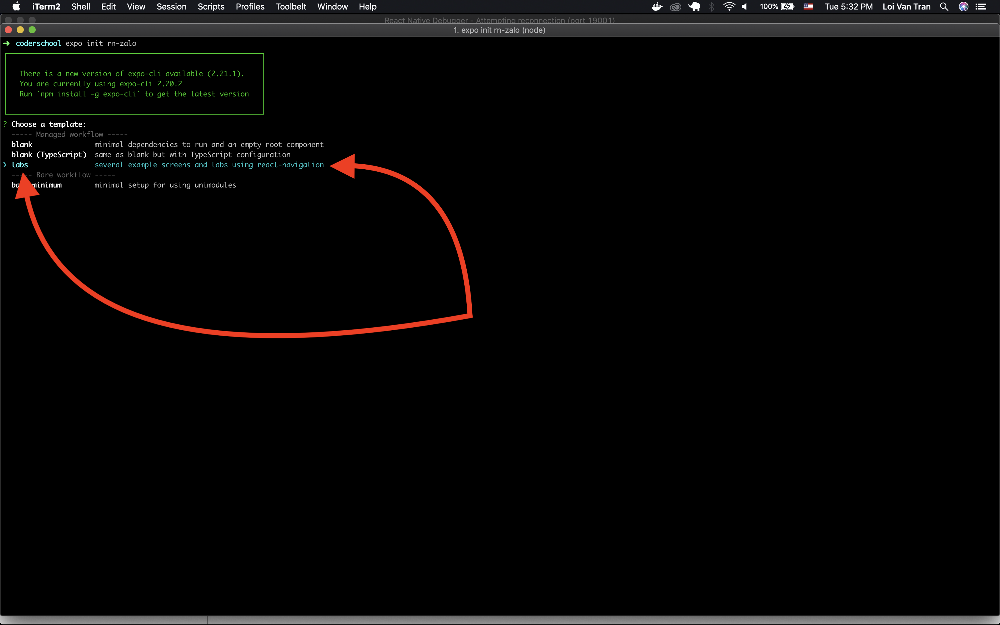
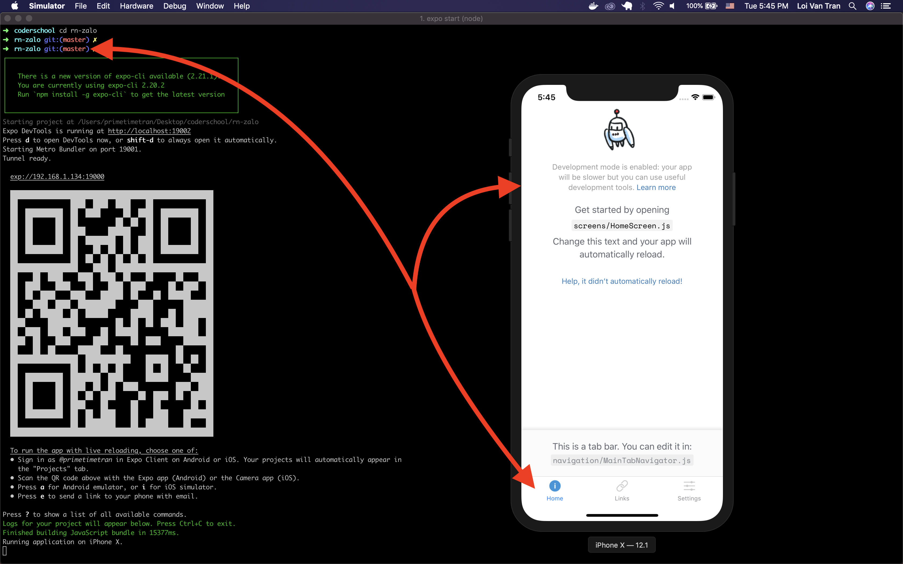

# WK3 - Lab - **Zalo Navigation**

## Introduction 🌟

Let's build a new app 📱 using [React Native](https://facebook.github.io/react-native/) & [Expo](https://expo.io/). We're going to clone Zalo. Our app will help users see a lot of unique content based on what it is they're looking for. This will require the use of a library called [React Navigation](https://reactnavigation.org/) that comes with Expo.


### Features 🎯🥇🏆

- [ ] User can see tabs at the bottom of the screen.
- [ ] User can press a tab to navigate to a unique screen.
- [ ] User can see tabs which corresponds to the tabs of Zalo.
- [ ] User can see a `Messsages` screen which has many messages.
- [ ] User can press on an individual message to navigate to a `Conversation` screen.
- [ ] User can see information about the user whose message they pressed on arriving at the `Conversation` screen.
- [ ] User can see an icon on the `Messages` screen which when pressed, opens a `Drawer`.
- [ ] User can see additional navigation items when they **open** the `Drawer`.

### Learning Objectives ✍️📚📝

1. Learn more about passing props.
    - Recognize we can pass many different props to components. These props can be of many different datatypes 🍚🥦🍗🌶. Types include `String`, `Boolean`, `Object`, and, `Function`.

> **Tip** 💡: 

### **Milestone 1 🛣🏃 Get up and running**

**A)** Use `expo init` to generate a new project. I'm calling mine `rn-zalo`. This time however, choose the **tabs** option when prompted.



#### We should now see a new initial app when we open our simulator that has 3 default tabs at the bottom



> **Tip** 💡: This project has a lot of stuff setup for you. Poke around the inital code to see how the team at Facebook likes structuring their projects.

**B)** 

<details>

<summary>Non self closing</summary>

```jsx
<View style={styles.container}>
  <Text>Please enter the value of the currency you want to convert</Text>
  <TextInput></TextInput>
</View>
```

</details>

<details>

<summary>Self closing</summary>

---

> **Key Points** 🔑📝

- Adding state to our application adds dynamic behavior. We can change the state of the application by using state. In this case we changed the state of which currency the user wants to convert `from` & `to`.

---

## Review 💻🤓🤔

- All components require some properties. The properties will be of many different shapes, many different data types 🍚🥦🍗🌶.

### Accomplishments 🥇🏆💯

- [X] User sees instructions advising them what to do

### Rockets 🚀

- [ ] User can convert from USD to EURO.
- [ ] User can convert from EURO to USD.
- [ ] User can convert from VND to EURO.
- [ ] User can convert from EURO to VND.
